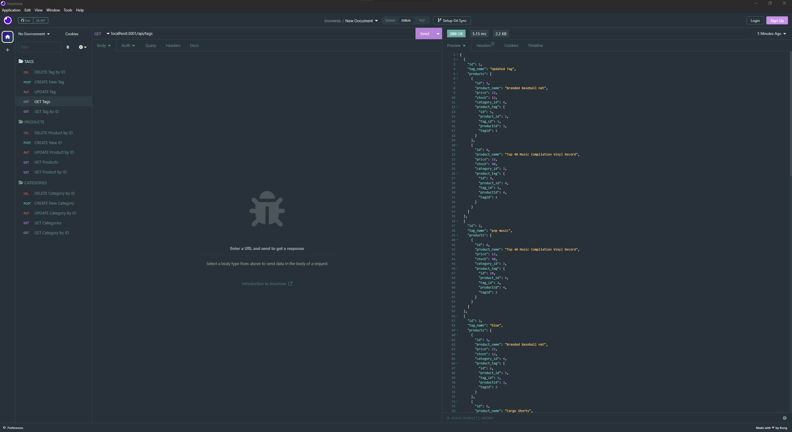
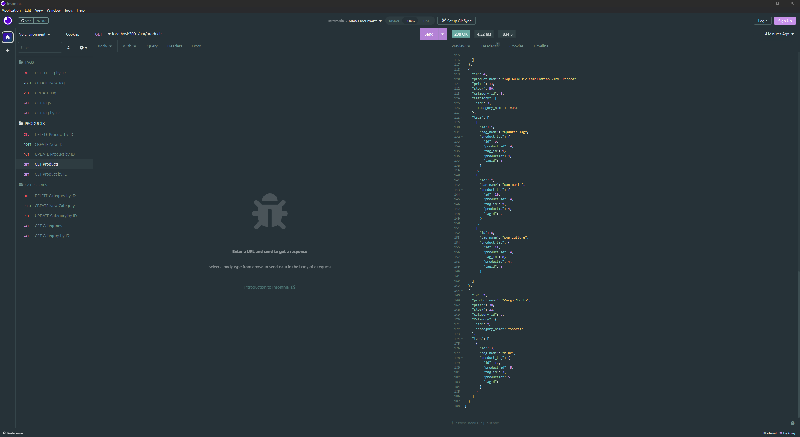
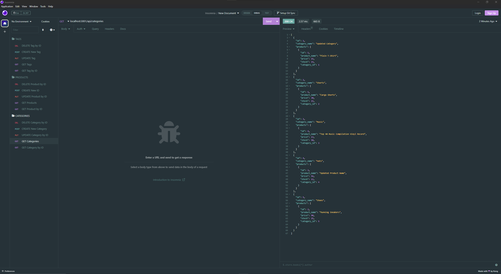

# e-commerce-back-end 

# Description

This project utilizes technologies and dependencies like node, sequelize, mysql, and express.

- This is a walkthrough video showing how the project works.

  https://drive.google.com/file/d/1ruBN5uzZFjGlfTDX2uvzJfjs2q6WCtQm/view

- Below are images of the project in use through insomnia.

  

  

  

## Table of Contents

- [Installation](#installation)
- [Usage](#usage)
- [Credits](#credits)
- [License](#license)

# Installation

The required installations and dependencies in order to use this app is node, inquirer, express, and an app to send responses and request to the server like insomnia or postman. Make sure you have downloaded each of these dependencies or the project will not work.

# Usage

Navigate to the file and open the terminal. Type in "mysql -u root -p" and then type in "source db/schema.sql" and exit out of the sql terminal. Type in "node server.js" and the server will begin. The route link is "localhost:3001/api". After "api" and another backslash and type "categories" if you would like categories, "tags" if you would like tags, or "products" if you would like porducts.

# Contributors

I am currently the lone contributor.

# License

This project uses the MIT license.

# Tests

There are currently no tests for this application so far.

# Questions

Contact me at mohamedfarah0508@gmail.com for any questions.
